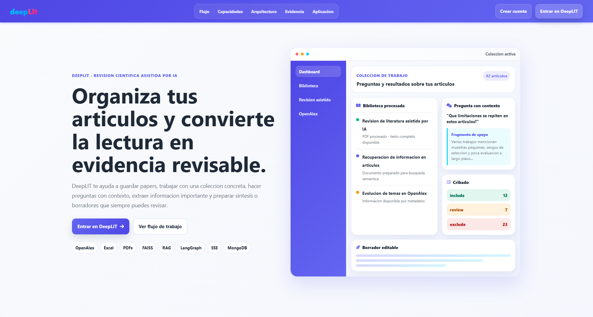
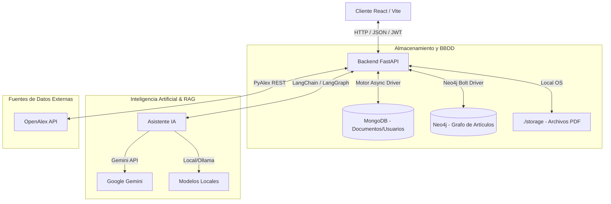

# deepLit: Plataforma Inteligente de Gestión de Literatura Científica

[](https://www.python.org)
[](https://fastapi.tiangolo.com)
[](https://react.dev)
[](https://vitejs.dev)
[](https://www.mongodb.com)
[](https://neo4j.com)



deepLit es una plataforma web diseñada para investigadores, académicos y profesionales interesados en automatizar y optimizar la gestión, el análisis y la redacción a partir de literatura científica. Combina técnicas de extracción de información, integración de catálogos internacionales con OpenAlex, bases de datos NoSQL (MongoDB), grafos de conocimiento (Neo4j) y agentes inteligentes RAG (Retrieval-Augmented Generation) para una mejor gestión y análisis de la literatura científica.

---

## Tabla de Contenidos

- [Características Principales](#características-principales)
- [Arquitectura del Sistema](#arquitectura-del-sistema)
- [Estructura del Proyecto](#estructura-del-proyecto)
- [Requisitos Previos](#requisitos-previos)
- [Guía de Inicio Rápido](#guía-de-inicio-rápido)
  - [1. Configuración del Backend](#1-configuración-del-backend)
  - [2. Configuración del Frontend](#2-configuración-del-frontend)
- [Configuración (.env)](#configuración-env)
- [Acceso a la Aplicación](#acceso-a-la-aplicación)
- [Contribución](#contribución)

---

## Características Principales

### Backend (FastAPI + LangChain / LangGraph)
- **Gestión de Artículos y PDFs:** Extracción de metadatos asistida por modelos de lenguaje y procesamiento OCR de PDFs mediante PyMuPDF y RapidOCR.
- **Grafo de Conocimiento (Neo4j):** Ingesta automática de artículos para construir redes relacionales de autores, palabras clave y categorías.
- **Flujos de Trabajo Científicos (AI Agents):**
  - **Screening (Cribado):** Filtrado y clasificación sistemática de artículos.
  - **Clustering:** Agrupamiento temático automático de documentos mediante embeddings.
  - **Evidence Extraction:** Extracción precisa de evidencias estructuradas a partir del contenido de los artículos.
  - **Collection Synthesis:** Generación de resúmenes analíticos y síntesis de colecciones completas.
  - **Asistente de Redacción (Scientific Writing):** Asistencia en la redacción científica basada en el contexto de la literatura importada.
- **Autenticación Segura:** JWT con expiración de sesión y cifrado bcrypt.

### Frontend (React + Vite)
- **Dashboard Analítico:** Panel visual con estadísticas del repositorio, distribución temporal de publicaciones e indicadores clave.
- **Visualización de Grafos:** Navegación interactiva de la red de relaciones entre artículos, autores y palabras clave (Neo4j).
- **Integración con OpenAlex:** Búsqueda avanzada de literatura en vivo e importación directa al repositorio local.
- **Flujos de Revisión Sistemática (Review Workflows):** Interfaz guiada paso a paso para cribar, agrupar, extraer evidencias y sintetizar literatura.
- **Diseño Moderno y Responsivo:** Interfaz limpia construida con CSS vanilla, soporte nativo de tema oscuro/claro y adaptabilidad móvil.

---

## Arquitectura del Sistema

La plataforma adopta una arquitectura desacoplada donde el cliente web interactúa con el servidor mediante peticiones HTTP estructuradas.



---

## Estructura del Proyecto

El repositorio está organizado como un monorepo simple que contiene el código de la API backend y la aplicación frontend web:

```
deepLit/
├── backend/                  # API Rest (FastAPI, Python)
│   ├── app/                  # Código fuente de la aplicación
│   │   ├── core/             # Núcleo (Auth, Exceptions, Respuestas estándar)
│   │   ├── models/           # Esquemas Pydantic
│   │   ├── repositories/     # Capa de persistencia (MongoDB)
│   │   ├── services/         # Lógica de negocio y agentes IA (RAG)
│   │   ├── controllers/      # Controladores de orquestación
│   │   ├── routers/          # Rutas y endpoints HTTP
│   │   └── workers/          # Procesamiento en segundo plano (JobWorker)
│   ├── tests/                # Pruebas automatizadas
│   ├── requirements.txt      # Dependencias de Python
│   └── .env.example          # Plantilla de variables de entorno
│
├── frontend/                 # Aplicación web (React, Vite)
│   ├── src/                  # Código fuente de React
│   │   ├── api/              # Llamadas centralizadas a la API
│   │   ├── components/       # Componentes visuales y layouts
│   │   ├── context/          # Estados globales (Auth, Theme, Collections)
│   │   ├── pages/            # Páginas principales del sitio web
│   │   └── styles/           # Hojas de estilo CSS organizadas
│   ├── index.html            # HTML base de Vite
│   ├── vite.config.js        # Configuración de Vite (incluye proxy de desarrollo)
│   └── package.json          # Dependencias y scripts de npm
```

---

## Requisitos Previos

Antes de comenzar, asegúrese de tener instalado en su entorno:

- **Node.js** >= 18.0.0
- **npm** >= 9.0.0
- **Python** = 3.12.x
- **MongoDB** ejecutándose en el puerto por defecto `27017`
- **Neo4j** (opcional, necesario para habilitar la visualización del grafo de conocimiento) ejecutándose en `bolt://localhost:7687`

---

## Guía de Inicio Rápido

### 1. Configuración del Backend

1. **Acceda al directorio del backend:**
   ```bash
   cd backend
   ```

2. **Cree y active un entorno virtual:**
   * **Windows:**
     ```cmd
     py -3.12 -m venv venv
     venv\Scripts\activate
     ```
   * **macOS/Linux:**
     ```bash
     python3.12 -m venv venv
     source venv/bin/activate
     ```

3. **Instale las dependencias de Python:**
   ```bash
   pip install -r requirements.txt
   ```

4. **Configure el entorno:**
   Copie la plantilla `.env.example` y cámbiele el nombre a `.env`:
   ```bash
   cp .env.example .env
   ```
   Genere una clave secreta para la firma de tokens JWT:
   ```bash
   openssl rand -hex 32
   ```
   Edite el archivo `.env` introduciendo la clave en la variable `SECRET_KEY`, además de su `GOOGLE_API_KEY` para habilitar las llamadas a Gemini.

5. **Inicie el servidor de desarrollo:**
   ```bash
   python -m uvicorn app.main:app --reload --host 0.0.0.0 --port 8000
   ```

El backend se iniciará en `http://localhost:8000`. Puede consultar la documentación interactiva en `http://localhost:8000/docs`.

---

### 2. Configuración del Frontend

1. **Acceda al directorio del frontend en una nueva terminal:**
   ```bash
   cd frontend
   ```

2. **Instale las dependencias del proyecto:**
   ```bash
   npm install
   ```

3. **Inicie el servidor de desarrollo local:**
   ```bash
   npm run dev
   ```

La aplicación se levantará en `http://localhost:3000` (Vite configurará automáticamente el proxy hacia el backend para redirigir las peticiones `/api`).

---

## Configuración (.env)

El backend requiere configurar ciertas variables en el archivo [backend/.env](backend/.env) para su correcto funcionamiento. Las principales configuraciones son:

- **`SECRET_KEY`**: Firma de tokens JWT de seguridad (Obligatorio).
- **`GOOGLE_API_KEY`**: Token de Google Gemini utilizado para extracción y RAG.
- **`OFFLINE`**: Si se establece en `True`, la aplicación utilizará Ollama (modelos locales) en lugar de Gemini.
- **`MONGODB_URL`**: Conexión a MongoDB (Por defecto: `mongodb://localhost:27017`).
- **`NEO4J_URL`, `NEO4J_USERNAME`, `NEO4J_PASSWORD`**: Credenciales de Neo4j para la construcción de grafos interactivos.

---

## Acceso a la Aplicación

- **Frontend (Interfaz de Usuario):** `http://localhost:3000`
- **Backend (API REST):** `http://localhost:8000`

---


## Contexto Académico

Este proyecto ha sido desarrollado como parte de un Trabajo Fin de Grado (TFG).

- **Autor/es:** Daniel Coleto Quereda, Alvaro Ferreño Iglesias, Alvaro Enol Alonso Ortega y Mario Baldocchi Sanchez
- **Tutor/es:** Pablo Cerro Cañizares
- **Institución:** Universidad Complutense de Madrid - Facultad de Informática
- **Titulación:** Grado en Ingeniería de Datos e Inteligencia Artificial
- **Año:** 2026

---

## Licencia

Este proyecto está licenciado bajo la Licencia MIT. Para más detalles, consulte el archivo [LICENSE](LICENSE) en la raíz del repositorio.

